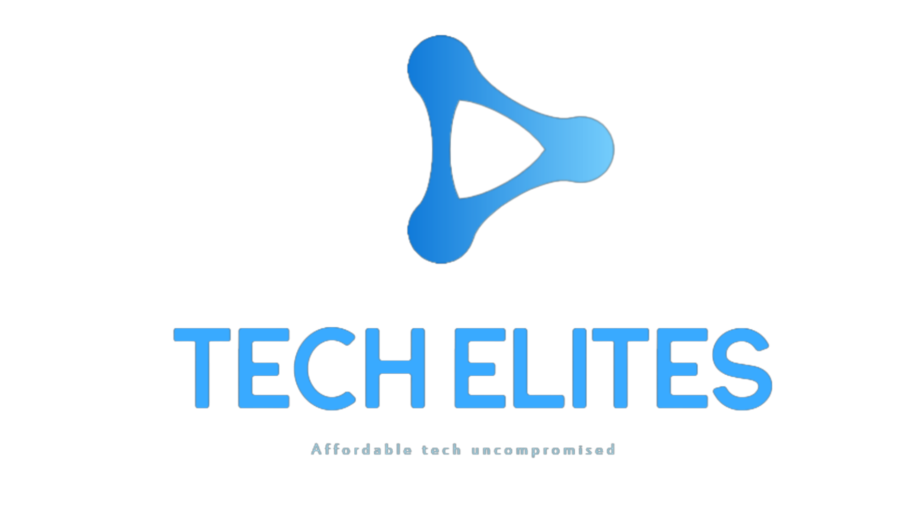

# Tech Elite: Project DIY

<h1 align="center">
About project
</h1>

 
The following files in this repository is the very code   
that is there which makes the claw movement possible.   
Please note that this project uses 100% open source   
tools and libraries to make it all possible.  

## Tools used:  
<em>*Visual Studio code.</em> The teams main source code editor and debugger. 
<em>*Arduino IDE.</em> It's needed even if we have Visual Studio Code installed. 
<em>*Platform IO.</em> Helps with providing extended functionalities when working with Arduino. 
<em>*Git.</em> This is mainly used for the version control of the files. 
<em>*Third party libs.</em> Any additional libraries which team members may have used to help with the project.  
 
## Links to tools and libraries used:
<em>*Visual Studio code:</em> https://code.visualstudio.com/  
<em>*Arduino IDE:</em> https://www.arduino.cc/en/software  
<em>*Platform IO: </em> https://platformio.org/  
<em>*Git: </em> https://git-scm.com/downloads  

